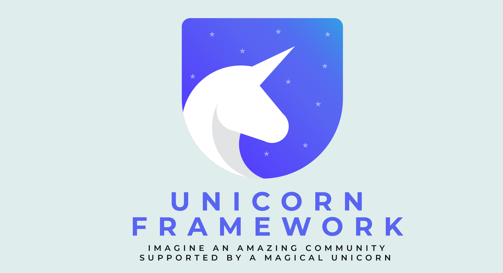

<p align="center">
  
</p>

<p align="center">
  A type-safe Discord bot framework built on <a href="https://discord.js.org/">Discord.js</a> and TypeScript, designed to run on <a href="https://bun.sh/">Bun</a>.
</p>

<p align="center">
  <a href="https://github.com/uniquepixels/unicorn/actions/workflows/ci-codeql.yml"></a>
  <a href="https://sonarcloud.io/summary/overall?id=UniquePixels_unicorn"></a>
  <a href="https://securityscorecards.dev/viewer/?uri=github.com/uniquepixels/unicorn"></a>
  <a href="https://www.bestpractices.dev/projects/12120"></a>
  <a href="https://discord.gg/Dk8P8h3e9u"></a>
  <a href="https://github.com/uniquepixels/unicorn"></a>
  <a href="https://github.com/UniquePixels/OpenCommunities"></a>
</p>

---

Unicorn gives you a structured system to build Discord bots for your communities using a **Spark** system for modular command and event handling, composable **Guards** for validation and gating, and type-safe configuration — so you can focus on building great communities, not plumbing. 🦄

## Features

- **Sparks** — modular handlers for slash commands, components (buttons/selects/modals), gateway events, and cron-scheduled tasks
- **Guards** — chainable validation with automatic TypeScript type narrowing. 15 built-in guards included
- **Type-safe config** — Zod-validated configuration with secret resolution and typed Snowflake IDs
- **Component pattern matching** — exact and parameterized matching for interactive components with automatic parameter extraction
- **Command scoping** — control where commands appear: guild, DMs, user-installed, or everywhere
- **Structured logging** — Pino-based logger with automatic redaction and optional Sentry integration
- **Health checks** — liveness and readiness endpoints for container orchestration
- **Graceful shutdown** — coordinated cleanup of cron jobs, health server, and the Discord client
- **[Lagniappe](https://github.com/uniquepixels/unicorn-lagniappe)** — a growing collection of drop-in sparks, guards, and utilities

## Quick Start

### Prerequisites

- [Bun](https://bun.sh/) v1.3+
- A [Discord bot token](https://discord.com/developers/applications)

### Setup

```bash
bun install
```

Update `src/config.ts` with your bot's application ID and desired intents:

```ts
export const appConfig = {
  discord: {
    appID: 'your-application-id',
    apiToken: 'secret://apiKey',
    intents: [GatewayIntentBits.Guilds],
    // ...
  },
} satisfies UnicornConfig;
```

Add your bot token to `.env` — Bun loads it automatically, no dotenv needed:

```env
apiKey=your-bot-token
```

```bash
bun start
```

## Sparks

Sparks are the building blocks of your bot. Each spark is a self-contained module that defines its trigger, optional guards, and action handler.

### Commands

```ts
import { SlashCommandBuilder } from 'discord.js';
import { defineCommand } from '@/core/sparks';

export const ping = defineCommand({
  command: new SlashCommandBuilder()
    .setName('ping')
    .setDescription('Check bot latency'),
  action: async (interaction) => {
    await interaction.reply(`Pong! ${interaction.client.ws.ping}ms`);
  },
});
```

Unicorn also supports [autocomplete](docs/commands.md#with-autocomplete), [subcommand groups](docs/commands.md#command-groups), and [context menu commands](docs/commands.md#context-menu-commands).

### Components

Handle buttons, select menus, and modals with pattern-matched IDs:

```ts
import { defineComponent } from '@/core/sparks';

export const confirmButton = defineComponent({
  id: 'confirm-action',       // exact match (O(1) lookup)
  action: async (interaction) => {
    await interaction.reply('Confirmed!');
  },
});
```

Supports exact and parameterized matching with automatic parameter extraction. See [Components](docs/components.md).

### Gateway Events

```ts
import { Events } from 'discord.js';
import { defineGatewayEvent } from '@/core/sparks';

export const memberJoin = defineGatewayEvent({
  event: Events.GuildMemberAdd,
  action: async (member, client) => {
    client.logger.info({ userId: member.id }, 'New member joined');
  },
});
```

Supports `once` mode, guards, and more. See [Gateway Events](docs/gateway-events.md).

### Scheduled Events

```ts
import { defineScheduledEvent } from '@/core/sparks';

export const dailyCleanup = defineScheduledEvent({
  id: 'daily-cleanup',
  schedule: '0 0 * * *',       // midnight UTC
  timezone: 'America/New_York', // optional
  action: async (ctx) => {
    ctx.client.logger.info('Running daily cleanup');
  },
});
```

Supports multiple schedules, timezones, and guards. See [Scheduled Events](docs/scheduled-events.md).

## Guards

Guards are composable validators that run before a spark's action. They chain sequentially with type narrowing — if a guard ensures a guild context, every subsequent guard and the action receive guild-typed interactions.

```ts
import { PermissionFlagsBits, SlashCommandBuilder } from 'discord.js';
import { defineCommand } from '@/core/sparks';
import { inCachedGuild, hasPermission } from '@/guards/built-in';

export const kick = defineCommand({
  command: new SlashCommandBuilder()
    .setName('kick')
    .setDescription('Kick a member'),
  guards: [inCachedGuild, hasPermission(PermissionFlagsBits.KickMembers)],
  action: async (interaction) => {
    // interaction is typed with guild guaranteed
  },
});
```

17 built-in guards ship with Unicorn. You can also [create your own](docs/guards.md#creating-custom-guards). See [Guards](docs/guards.md) for the full reference.

## Configuration

Type-safe configuration with Zod schemas, automatic secret resolution from environment variables, and typed Snowflake IDs:

```ts
import type { UnicornConfig } from '@/core/configuration';

export default {
  apiKey: 'secret://BOT_TOKEN',
  ids: {
    guild: { main: '123456789' },
    role:  { admin: '987654321' },
  },
} satisfies UnicornConfig;
```

See [Configuration](docs/configuration.md) for the full schema, secret handling, environment mapping, and health check setup.

## Documentation

- [Commands](docs/commands.md) — slash commands, autocomplete, subcommand groups, context menus
- [Components](docs/components.md) — interactive components (buttons, select menus, modals) with exact and parameterized matching
- [Guards](docs/guards.md) — built-in guards, custom guards, composition, type narrowing
- [Gateway Events](docs/gateway-events.md) — event listeners, once vs recurring
- [Scheduled Events](docs/scheduled-events.md) — cron tasks, timezones, lifecycle
- [Configuration](docs/configuration.md) — config schema, secrets, environment mapping, health checks
- [Errors](docs/errors.md) — AppError, error handling strategy, best practices
- [Logger](docs/logger.md) — structured logging, redaction, Sentry integration
- [Emoji](docs/emoji.md) — application emoji resolver

## Support

- [Open an issue](https://github.com/uniquepixels/unicorn/issues) for bug reports and feature requests
- [Join the Discord](https://discord.gg/Dk8P8h3e9u) for questions, help, and discussion

## Contributing

See [CONTRIBUTING.md](CONTRIBUTING.md) for development setup, code style, and pull request guidelines.

## License

[MIT](LICENSE)

---
